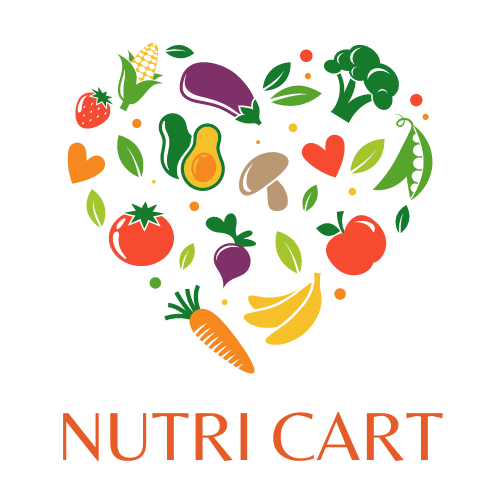

<p align="center">
  
</p>

Video: https://youtu.be/WqpZ2eCeidM

Nutri-Cart is a personalized grocery shopping web app designed to simplify the process of balancing nutrition, time, and budget constraints. Developed with the needs of college students, parents, and budget-conscious individuals in mind, Nutri-Cart offers tailored recommendations for maximizing nutrition, affordability, or quality based on user preferences.

## Try it out!

```bash
# 1. Clone the repository.
git clone https://github.com/SreeyuR/hacktech-final.git

# 2. Navigate to the directory where the website is located.
cd nutr-cart-new

# 3. Make sure you have a local server set up. VS code is recommended.

# 4. Navigate to `index.html` and press "Live Server" on the bottom right of vs code to host the webpage.

# 5. Create an account and you're in!

# 6. To try the ML model
    # a. Navigate into the root directory of this project.
      cd ..
    # b. Run the ML model.
      python3 heartdisease_model.py
```

## Features:
- **Personalized Recommendations:** Complete a questionnaire to customize your shopping experience based on lifestyle, dietary needs, and budget goals.
- **Smart Shopping:** Nutri-Cart ranks nearby grocery stores within a 20-mile radius according to price or nutritional values, ensuring the best options are recommended for each user.
- **Health Predictions:** Utilizing a machine learning algorithm, Nutri-Cart predicts an individual's risk of cardiovascular disease based on various factors, empowering users to make informed lifestyle choices.
- **Next Steps:** Future developments include implementing collaborative filtering for predicting new grocery items, expanding into recipe suggestions and meal planning, integrating Google Maps API for location-specific data, and expanding capabilities to include restaurant recommendations.

## Technologies Used:
- **Front End:** HTML, CSS, JavaScript, Bootstrap
- **Back End:** Firebase, JavaScript
- **Machine Learning:** Python

## What’s Next:
- **Collaborative Filtering:** Predict new grocery items for users based on their shopping habits.
- **Recipe Suggestions and Meal Planning:** Provide curated recipes and meal plans tailored to user preferences.
- **Google Maps Integration:** Gather data on local grocery stores, food pantries, delivery services, and Farmers’ Markets.
- **Expansion to Restaurants:** Identify nutritious and cost-effective dining options.
- **Enhanced Algorithm:** Refine recommendation algorithm for greater precision and personalization.

Join us in revolutionizing grocery shopping and promoting healthier lifestyles with Nutri-Cart!
